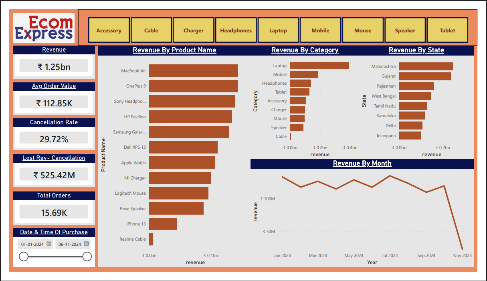

# Ecom Express — E-Commerce Sales Dashboard (Power BI)


> An end-to-end **business intelligence dashboard** built in Power BI analysing sales, cancellations, geographic performance, and product-level revenue for a fictional Indian e-commerce company — Ecom Express.

---

## Dashboard Preview



---

## Project Overview

This project simulates a real-world BI analyst task: taking raw transactional data across three relational tables and converting it into an executive-ready Power BI dashboard that surfaces actionable insights for business decision-makers.

**Period covered:** January 2024 – November 2024  
**Total records analysed:** 15,690 orders · 462 customers · 12 products across 9 categories  
**Geography:** 8 Indian states (Maharashtra, Gujarat, Rajasthan, West Bengal, Tamil Nadu, Karnataka, Delhi, Telangana)

---

## Key Metrics Uncovered

| Metric | Value |
|---|---|
| Gross Revenue | ₹1.77 Billion |
| Net Revenue (Delivered) | ₹1.25 Billion |
| Average Order Value | ₹1,12,917 |
| Total Orders | 15,690 |
| Cancellation Rate | **29.72%** (Critical) |
| Lost Revenue — Cancellations | ₹525.42 Million |

---

## Dashboard Features

- **Category Filter (Slicer):** Filter all visuals by product category — Accessory, Cable, Charger, Headphones, Laptop, Mobile, Mouse, Speaker, Tablet
- **Date Range Slicer:** Dynamic date slider from 01-Jan-2024 to 06-Nov-2024
- **Revenue by Product Name** — Horizontal bar chart showing top 12 products
- **Revenue by Category** — Comparative bar chart across all 9 categories
- **Revenue by State** — Geographic performance across 8 states
- **Revenue by Month** — Line chart showing monthly revenue trend with November truncation note
- **KPI Cards:** Revenue · Avg Order Value · Cancellation Rate · Lost Revenue · Total Orders

---

## Files in this Repository

```
ecom-express-powerbi/
├── Customers.csv                          # 462 customer records with state & phone brand
├── Ecom_Express_Analysis.pdf
├── Ecom_Express_PowerBI_Dashboard.pbix    # Main Power BI file
├── Orders.csv                             # 15,690 order records with delivery status
├── Products.csv                           # 12 products with category, price & ratings
├── README.md
└── dashboard_preview.png                  # Screenshot of the completed dashboard
```

---

## Data Model

Three tables connected via shared keys:

```
Customers (CustomerID) ──< Orders (CustomerID, ProductID) >── Products (ProductID)
```

**Customers:** CustomerID · Name · Phone · City · State · Phone Brand · Operating System  
**Orders:** OrderID · CustomerID · ProductID · Quantity · Date of Purchase · Delivery Time · Delivery Status  
**Products:** ProductID · Product Name · Category · Price · Rating · Number of Ratings

---

## DAX Measures Used

```DAX
-- Total Revenue
Revenue = SUMX(Orders, Orders[Quantity] * RELATED(Products[Price]))

-- Cancellation Rate
Cancellation Rate = 
DIVIDE(
    COUNTROWS(FILTER(Orders, Orders[Delivery Status] = "Cancelled")),
    COUNTROWS(Orders)
)

-- Lost Revenue due to Cancellations
Lost Revenue = 
CALCULATE(
    SUMX(Orders, Orders[Quantity] * RELATED(Products[Price])),
    Orders[Delivery Status] = "Cancelled"
)

-- Average Order Value (Delivered only)
Avg Order Value = 
CALCULATE(
    AVERAGEX(Orders, Orders[Quantity] * RELATED(Products[Price])),
    Orders[Delivery Status] = "Delivered"
)
```

---

## Key Business Insights

1. **Cancellation crisis:** 29.72% cancellation rate — nearly 2x the Indian e-commerce industry benchmark of 10–15%. ₹52.5 Cr in revenue is lost before delivery.
2. **Laptop dominance:** The Laptop category drives 31.5% of gross revenue, with MacBook Air and HP Pavilion as top performers.
3. **Cable underperformance:** Realme Cable has the highest customer rating (4.7★) but contributes only 0.5% of revenue — a bundling opportunity.
4. **Geographic concentration:** Maharashtra + Gujarat = 38.9% of revenue. Delhi and Telangana are underperforming relative to their metro potential.
5. **Revenue consistency:** Monthly revenue is stable at ~₹17–18 Cr except for festive dips in February, April, and September.

---

## Tools & Technologies

- **Power BI Desktop** — Data modelling, DAX, and dashboard design
- **Microsoft Excel / CSV** — Raw data source
- **DAX** — Custom measures for KPIs
- **Power Query** — Data transformation and relationship mapping

---

## How to Use

1. Clone or download this repository
2. Open `Ecom_Express_PowerBI_Dashboard.pbix` in Power BI Desktop
3. If prompted, update data source paths to point to the local CSV files
4. Interact with slicers to filter by category and date range

---

## About the Author

**Amarendra Andia** — B.Tech Metallurgical & Materials Engineering, NIT Jamshedpur  
Aspiring Data Analyst with a focus on manufacturing, operations, and business intelligence.

---

*This is a portfolio project built on synthetic data for demonstration purposes.*
